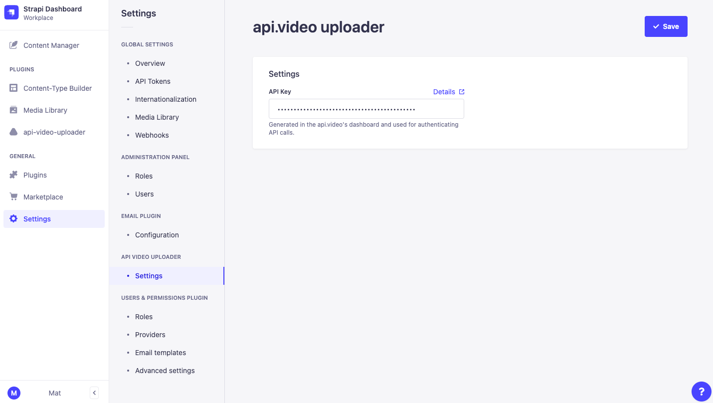

<div align="center" width="150px">
  
</div>
<div align="center">
  <h1>Strapi v4 - api.video uploader</h1>
  <p>Powerful Strapi tool for managing uploads to <a href="https://api.video">api.video</a>.</p>
     <a href="https://twitter.com/intent/follow?screen_name=api_video"></a>
    <a href="https://community.api.video"></a>
</div>

---

<div style="margin: 20px 0" align="center">
  
</div>

<p align="center">
This plugin provides the ability to upload content via a file to upload to  <a href="https://api.video" target="_blank" >api.video</a>.

<br />

<!-- TABLE OF CONTENTS -->

### Table of Contents

- [✨ Features](#-features)
- [⏳ Installation](#-installation)
  - [Via Strapi Marketplace](#via-strapi-marketplace)
  - [Via command line](#via-command-line)
- [🖐 Requirements](#-requirements)
- [🔧 Configuration](#-configuration)
- [👤 Permissions](#-permissions)
- [🤝 Contributing](#-contributing)
- [📚 References](#-references)

## ✨ Features

- **Upload videos** using a file to [api.video](https://api.video) inside of [Strapi](https://strapi.io/)
- **Manage assets** with the plugin's asset grid and pagination capabilities
- **Search** for assets using title
- **Preview content** using our player (powered by the [api.video-player-react](https://github.com/apivideo/api.video-react-player) package)
- **Delete assets** which result in the [api.video](https://api.video) Asset also being deleted

## ⏳ Installation

### Via Strapi Marketplace

Coming soon

### Via command line

(Use **yarn** to install this plugin within your Strapi project (recommended). [Install yarn with these docs](https://yarnpkg.com/lang/en/docs/install/).)

```bash
yarn add strapi-plugin-api-video-uploader@latest
```

After successful installation you've to re-build your Strapi instance. To archive that simply use:

```bash
yarn build
yarn develop
```

or just run Strapi in the development mode with `--watch-admin` option:

```bash
yarn develop --watch-admin
```

The **api-video-uploader** plugin should appear in the **Plugins** section of Strapi sidebar after you run app again.

As a next step you must configure your the plugin by the way you want to. See [**Configuration**](#🔧-configuration) section.

All done. Enjoy 🎉

## 🖐 Requirements

**api.video**

- A [api.video](https://api.video) account
- You will only an **Api Key** which can be created in the [api.video Dashboard](https://dashboard.api.video/apikeys)

Complete installation requirements are exact same as for Strapi itself and can be found in the documentation under [Installation Requirements](https://docs.strapi.io/developer-docs/latest/getting-started/introduction.html).

**Minimum environment requirements**

- Node.js `>=14.19.1 <=18.x.x`
- NPM `>=6.x.x`

In our minimum support we're following [official Node.js releases timelines](https://nodejs.org/en/about/releases/).

**Supported Strapi versions**:

- Strapi v4.5.1 (recently tested)
- Strapi v4.x

> This plugin is designed for **Strapi v4** and is not working with v3.x.

**We recommend always using the latest version of Strapi to start your new projects**.

## 🔧 Configuration

In order for this plugin to communicate with [api.video](https://api.video), a configuration needs to be set for the plugin before it can be used.

With your **Api Key**, navigate to the Settings view within [Strapi](https://strapi.io/) and click the "General" section under **API VIDEO UPLOADER**.

On this view, enter your Api Key and click the Save button.

<div style="margin: 20px 0" align="center">
  
</div>

To resolve **Content Security Policy directive** issue and to visualize the thumbnail and the video, we need to configure external ressource like `embed.api.video`and `cdn.api.video/vod/`. Modify the `middlewares.js` file like below:

```javascript
// config/middlewares.js
module.exports = ({ env }) => [
  "strapi::errors",
  {
    name: "strapi::security",
    config: {
      contentSecurityPolicy: {
        useDefaults: true,
        directives: {
          "connect-src": ["'self'", "https:"],
          "img-src": [
            "'self'",
            "data:",
            "blob:",
            "embed.api.video",
            "cdn.api.video/vod/",
          ],
          "frame-src": ["'self'", "data:", "blob:", "embed.api.video"],
          upgradeInsecureRequests: null,
        },
      },
    },
  },
  "strapi::cors",
  "strapi::poweredBy",
  "strapi::logger",
  "strapi::query",
  "strapi::body",
  "strapi::favicon",
  "strapi::public",
];
```

## 👤 Permissions

Only "Super Admin" can access to the settings page [Strapi](https://strapi.io/). Others instance will be able to utilize the plugin for uploading and managing content.

## 🤝 Contributing

Contributions, issues and feature requests are welcome!

If you encounter an error or have questions, please feel free to file inquiries on the [Issues](https://github.com/apivideo/api.video-strapi-plugin/issues) page for `strapi-plugin-api-video-uploader`.

## 📚 References

- [api.video](https://docs.api.video/docs/apivideo-api-reference)
- [Strapi.io](https://strapi.io/)
